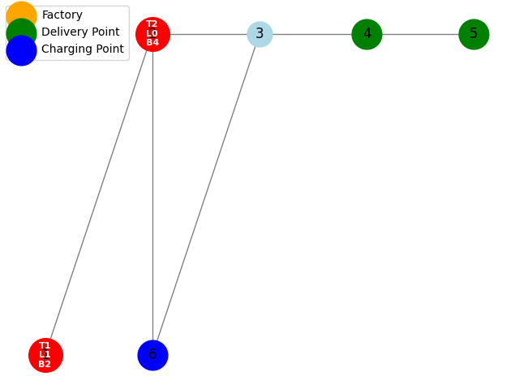

# ASP-DeliveryPlanning
Repository for the Delivery Planning project using ASP and the Clingo Python package. This project focuses on finding optimal delivery routes in any input graph. 

<table align="center" name="fig3">
  <tr align="center">
      <td></td>
  </tr>
  <tr align="left">
    <td colspan="2"><b>Figure 3.</b> Proposed architecture combining SegVol model and Hermes context-prior framework. This hybrid model integrates SegVol’s volumetric segmentation with Hermes’s context-prior learning.</td>
  </tr>
</table>

## Getting Started

This guide will help you set up the environment and run the Delivery Planning project using ASP and the Clingo Python package.

### Dependencies

The project requires the following dependencies:
- `python=3.8`
- `ipython`
- `clingo`
- `matplotlib`
- `networkx`

### Environment Setup

1. **Clone this repository**:
    ```bash
     git clone https://github.com/danilotpnta/ASP-DeliveryPlanning.git
     cd ASP-DeliveryPlanning 
     ```

2. **Create the Conda Environment**:
   - Open a terminal and navigate to the directory containing the `environment.yaml` file.
   - Run the following command to create a new Conda environment:
     ```bash
     conda env create -f environment.yaml
     ```

3. **Activate the Environment**:
   - Activate the newly created environment using:
     ```bash
     conda activate delivery-planning-env
     ```

### Running the Notebook

1. **Start Jupyter Notebook**:
   - In the terminal, start Jupyter Notebook:
     ```bash
     jupyter notebook
     ```

2. **Open the Notebook**:
   - Navigate to the directory where the notebook (`hw3_14077566_15002861-2.ipynb`) is located and open it.
